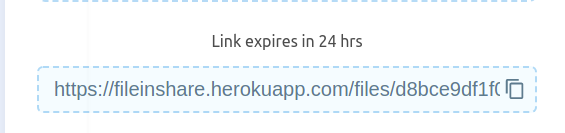
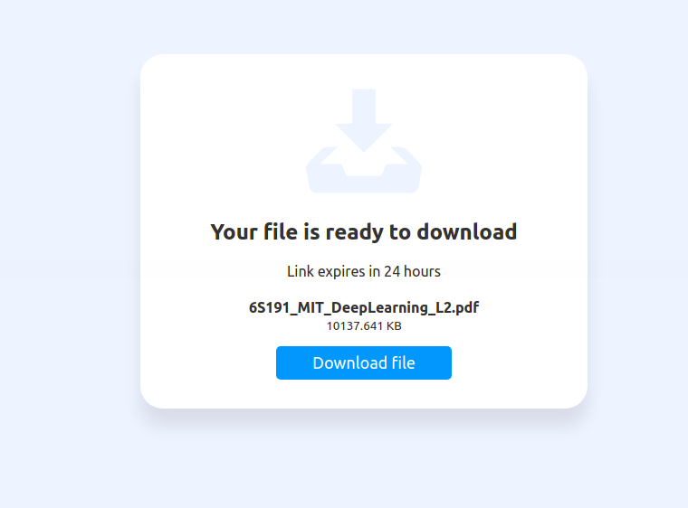
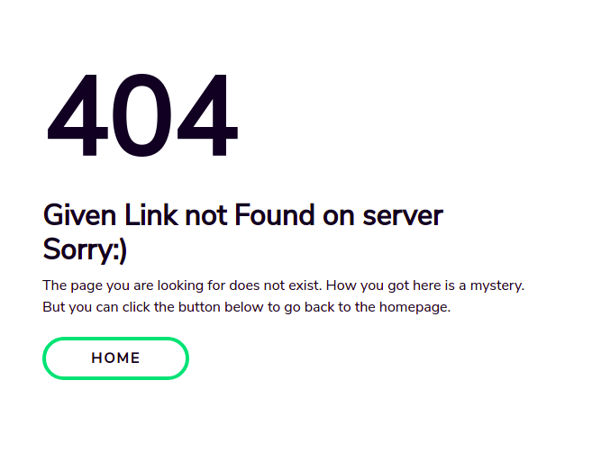

> ApI is hosted at Heroku and frontend at netlify [Give it a try !!](https://in-share.netlify.app/)

## Overview:)

- **inShare is a simple file sharing webapp that share file upto 100MB size.**

## Techstack used:)
- Python
- Flask
- MongoDB (Database)
- HTML
- CSS
- Javascript
- Heroku (Deployment)
- Heroku Scheduler (For deleting file after 24 hour)

## How to used:)

- Go to this link https://in-share.netlify.app and click on browse or dragg file
and keep in mind file size should we <= 100MB and don't upload a folder make 
a zip file before uploading.


- Now file upload will start uplading to the server


- After upload is finished you will get an unque link to copy 
share that link to that perosn you want's to share file 



- Or you can mail that unique link by providing correct email 


- After pasting that unique link will open a download page and you have to simply click on download  file



- The email send to the reciver will look like


- If you alter inside the uuid of the download link that will lead to a 404 page



## To start this app locally:)
- Clone this repo 

```sh
git clone https://github.com/devil-cyber/inShare

```
- Go to the instance directory and open config.py file and fill the required field

- Now create enivornment

```sh
pip install virtualenv

# After installation complete
# Go inside inShare directory and open terminal and fire cmd

virtualenv venv
source venv/bat/activate

```

- Now install all required library

```sh
pip install -r requirements.txt

```
- After all installation complete

```sh
python run.py

or
 
gunicorn --workers=3 --threads=3 run:app
```

- App will start at http://localhost:5000 and for gunicorn app will start at http://localhost:8000


### 🙏 If you find this repo helpful then don't forget to give a star ❇️ to this repository.

For any issue mail me at [Mail Me](mailto:mani2474695@gmail.com)
